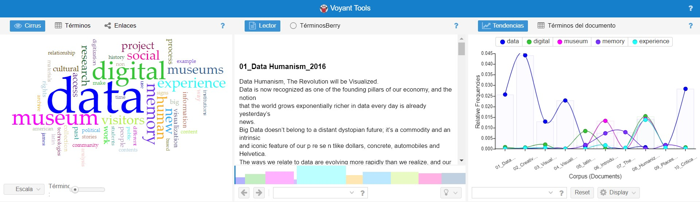
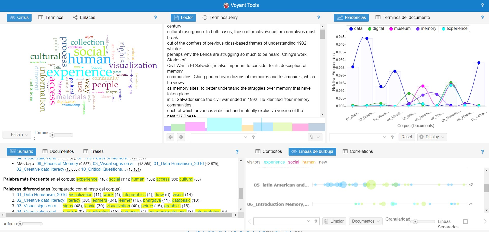

# **MemoryExperience**
### **Semana 4: Ejercicio de análisis de textos de bibliografía**
### *Angela Milena Ortiz Torres*

[Link del ejercicio en Voyant Tools](https://voyant-tools.org/?corpus=b6091c215866144e7b3d11c1e8c6aa70)
 
 
 
La herramienta me pareció muy interesante, pues al ver y entender la información de los artículos desde una manera gráfica y visual, permite obtener más datos que extienden la perspectiva que tenía respecto de los conceptos principales que articulan mi investigación. Por ejemplo, al inicio me arrojó palabras obvias que han sido una constante en el momento de hacer la búsqueda de referentes, como por ejemplo: _data_, _digital_, _memory_, _museum_.
 
 

 
 
Pero al exceptuar esas palabras empezaron a salir términos que me parecen apropiados para ampliar la búsqueda de información y enriquecer la investigación como por ejemplo; social, experience, human, cultural, información, collection. 
 
 

 
 
Estos nuevos conceptos, son de gran ayuda para ir enfocando con más precisión la investigación pues da la oportunidad de seguir indagando otras rutas de conocimiento. En definitiva, considero que es un ejercicio oportuno para dejar de pensar en lo obvio y empezar a abrir la perspectiva de nuevos conceptos que también están relacionados y son útiles dentro de la investigación que estamos llevando a cabo.
